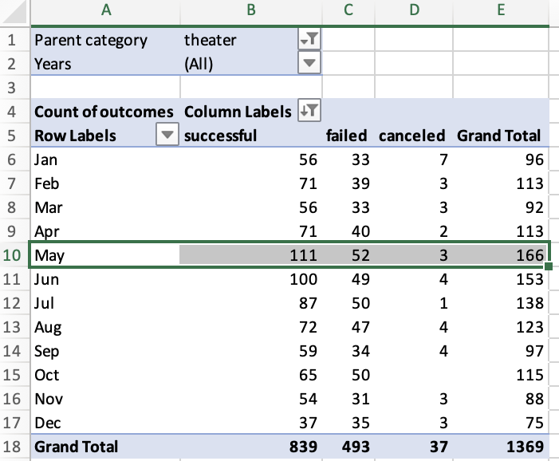
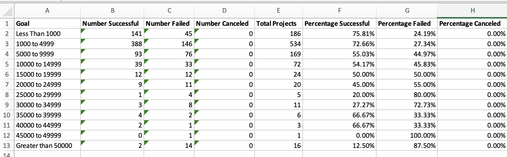

# **Kickstarter-Analysis**

## Overview
Performing analysis on the [Kickstarter](Kickstarter_Challenge.xlsx) data to uncover trends to help Louise to set up her first Kickstarter campaign.
For her play Fever, Louise is aiming over $10,000. 
But she is not sure, so with [Kickstarter](Kickstarter_Challenge.xlsx) data by analyzing the outcomes based on launch date and the outcomes on goals, we are going to help her to figure out the factors that will make the campaign successful.

### 1. Outcomes based on Launch Date

#### -Analysis and Challenges
To figure out the relationship between outcomes and launch date, make a pivot table filtering with "Parent Category" and "Years" from [Kickstarter](Kickstarter_Challenge.xlsx) data. For column labels, show only "successful", "failed" and "canceled" by outcomes in descending order.  And for row labels, show by months, but there was a challenge. Filtering by "Years" shows quarters on the rows. So, I had to remove "Quarters" and put "Date Created Conversion" instead to correct. After that, in the pivot table, filter the "Parent Category" on "theater" specifically to show trends to match Louise's interest. Finally the pivot table is made in the sheet labeled "Theater Outcomes by Launch Date" in [Kickstarter](Kickstarter_Challenge.xlsx) data .
And I was able to make a linear graph chart that shows the relationship between outcomes and the launch date by months as shown below.

#### -Results
1.	The month that launched the most successful Kickstarter campaign was May. 
2.	The month that launched the most failed Kickstarter campaign was May.

May had both the most successful and failed numbers of campaigns, and also the May had the most campaign count in total shown in the pivot table below.

Since May is both the most failed month and successful month, we need to consider the proportion of outcomes of "successful", "failed" and "canceled" in each month, . Rather than using the linear graph chart, which shows the outcome numbers, a stacked bar chart, which shows the Percentage of outcomes of "successful", "failed" and "canceled" of each month, would be better to represent the relationship between outcomes and the launch date by each month. In this case, we may use COUNTIFS() and SUM() functions to figure out the percentage of numbers in outcomes in a table and y-axis would be labeled percentage(%) and x-axis be labeled months on a stacked bar chart.

### 2. Outcomes based on Goals
#### -Analysis and Challenges
To figure out the relationship between the outcomes and goals, make ranges on goals($) in row indexes for a table.  And use COUNTERIFS() function to populate "Number Successful," "Number Failed," and "Number Canceled" columns. Then use SUM() to count the "Total Projects" and calculate the percentage of successful, failed, and canceled projects by division. The challenge here was using COUNTERIFS() function to sort out "Number Successful," "Number Failed," and "Number Canceled" because I had to type all the IF conditions for the columns according to the range for each row. The table below shows results from the functions and calculations. 

With the table we can make a line graph chart below to show the relationship between percentage outcomes and campaign goal amount($). 

#### -Results
The goal that has the most successful percentage rate in campaign is less than $1000. 
This general trend shows that lower goal for crowdfunding will result more successful outcome, which shows negative linear relationship. 
This indicates that Louise has better success if she lowers her goal amount, which was initially $10,000.
However, there is a point that successful percentage increases as the goal increases. At that point we need to consider outliers to get rid of extremes that affect the result. Surely, the graph shows limitation for Louise to set up her goal amount. 
By using functions STDEV.P(), QUARTILE.EXC(),IQR, mean and median, we can create a statistical chart, and make a box and whisker plots. In this way, it will suggest better average successful goal target amount.    

## Conclusion
We have looked up [Kickstarter](Kickstarter_Challenge.xlsx) data to help Louise analyzing theater trends with tables and charts.  As we set up launch date and goals as factors that cause the successful or failed outcomes, we can conclude which month and amount will help Louise to set up her Kickstarter campaign. According to the graph charts May is the best month to start her campaign and it is better to lower her goal amount, which is $10,000, since goals with less than $1,000 have better successful percentage.

