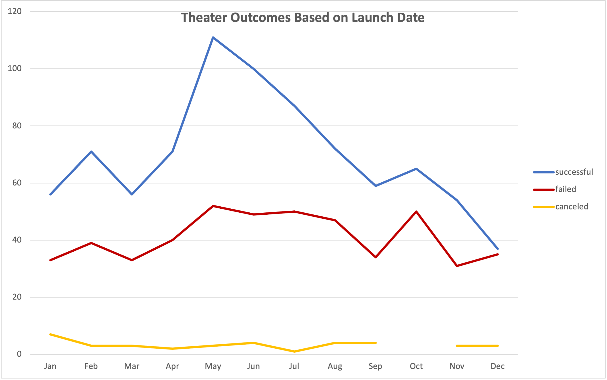
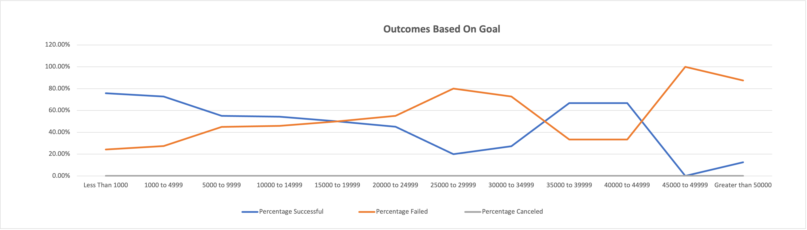

# **Kickstarter-Analysis**

## Overview
Performing analysis on the Kickstarter data to uncover trends to help Louise to set up her first Kickstarter campaign.
For her play Fever, Louise is aiming over $10,000. 
But she is not sure, so with Kickstarter data by analyzing the outcomes based on launch date and the outcomes on goals, we are going to help her to figure out the factors that will make the campaign successful.

### 1. Outcomes based on Launch Date

#### -Analysis and Challenges
To figure out the relationship between outcomes and launch date, make a pivot table filtering with "Parent Category" and "Years" from kickstarter data . For column labels, show only "successful", "failed" and "canceled" by outcomes.  And for row labels, show by months, but there was a challege. Filtering by "Years" shows quaters on the rows. So i had to remove "quaters" and put "date created conversion" instead to correct.  After that, in the pivot table, filter the "parent categroy" with "theater" specifically to show trends to match Louise's interest. And i was able to make a linear line graph that shows the relaitonshiop between outcomes and the launch date by months as shown below. 

#### -Results

### 2. Outcomes based on Goals
#### -Analysis and Challenges

#### -Results

## Conclusion
